# Driver — Feature Guide

Deliveries, parcels and payouts in one app

> This guide is generated automatically on every merge: CI builds the
> app, walks the guided tour on an Android emulator, and captures
> each screen below.

## 1. Welcome to Driver

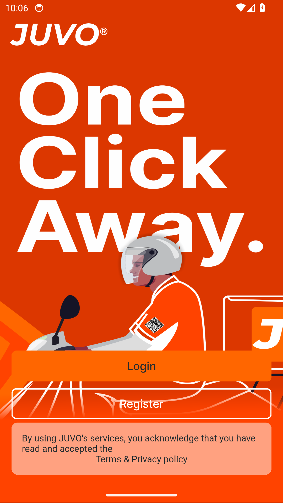

Driver puts your whole delivery day in one app - sign in to get started.

## 2. Sign in

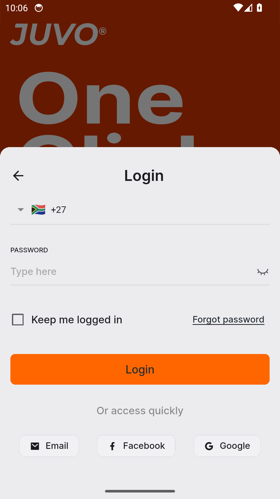

Signing in to Driver is quick and simple.

## 3. Create an account

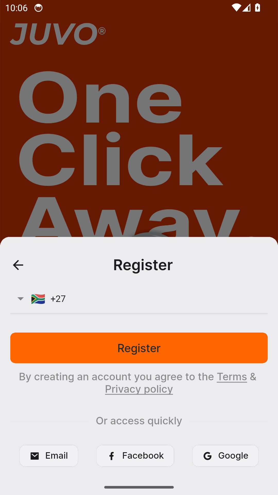

New to Driver? Create your account in a few easy steps.

## 4. Reset your password

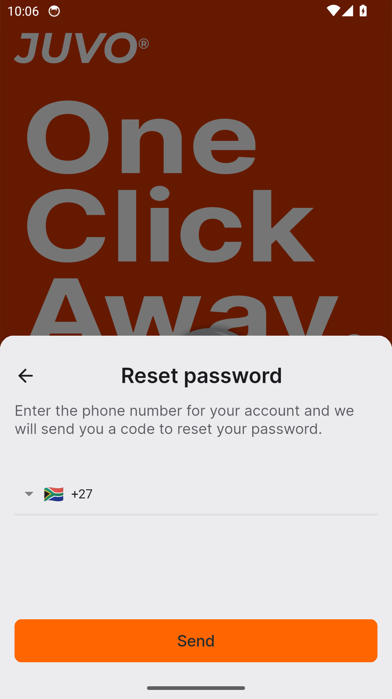

Forgot your password? Driver gets you back in with a secure reset.

## 5. Your day on the map

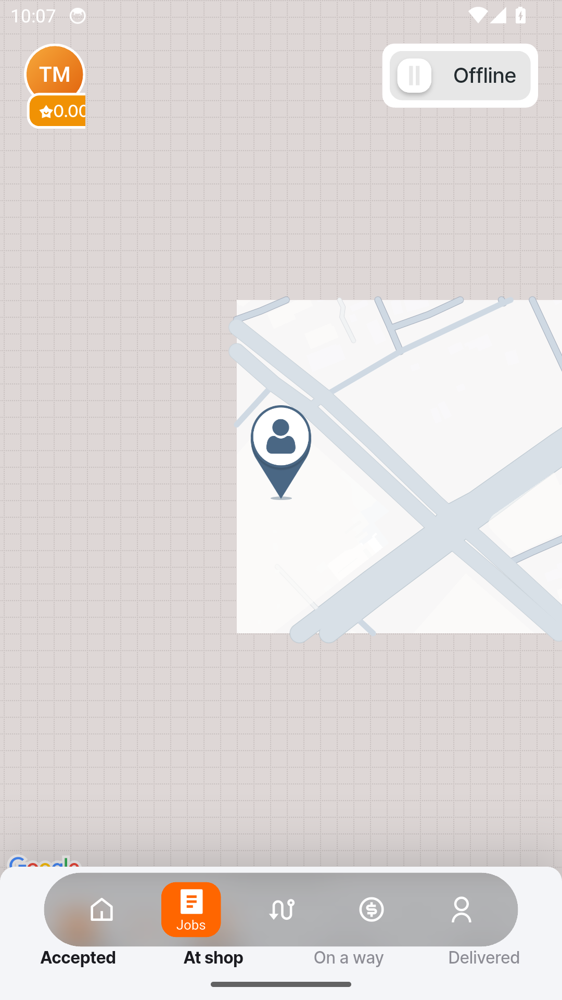

Go online and drive - your zone, your current delivery and your next job all
live on one map.

## 6. Deliveries in hand

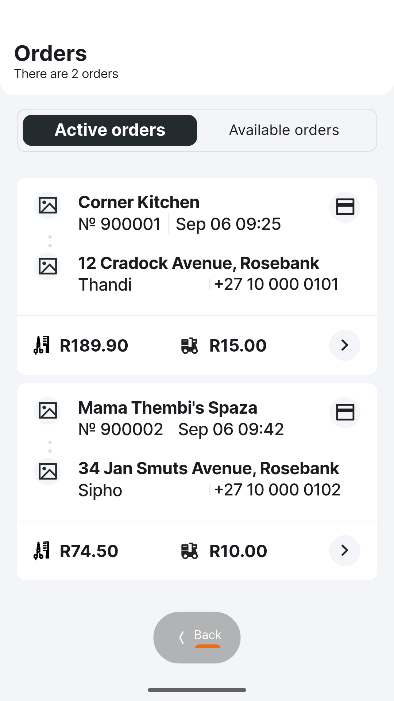

Every delivery you have accepted, with the customer, the total and the cash to
collect up front.

## 7. The next job is waiting

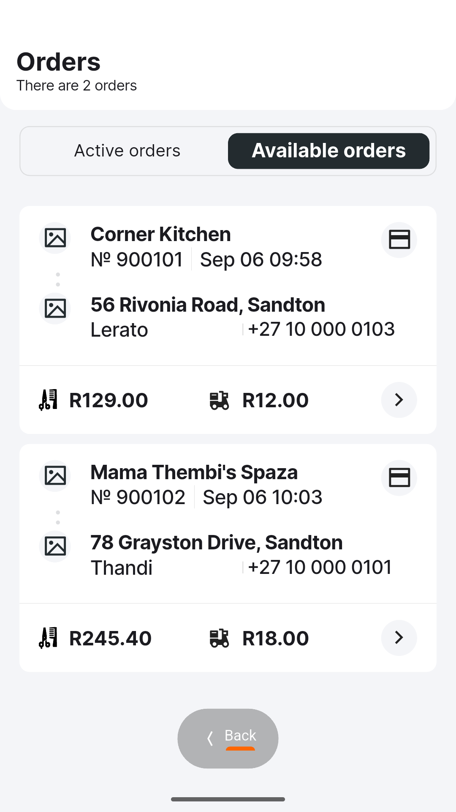

Orders ready nearby - grab the next job with one tap. On the launcher: the shop,
the drop and Accept, never the money.

## 8. Every stop, in order

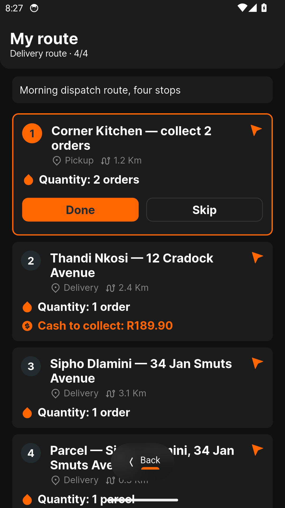

Dispatch lines up your stops - pickups first, then drop-offs - with distance and
cash per stop.

## 9. Proof of every drop

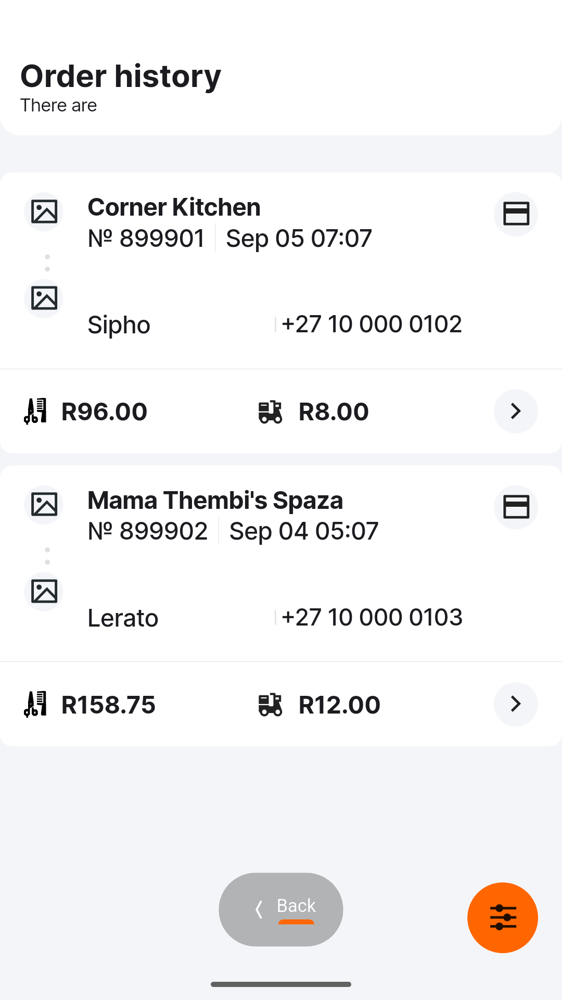

Your delivered orders stay on record - filter any date range when you need to
look back.

## 10. Parcels too

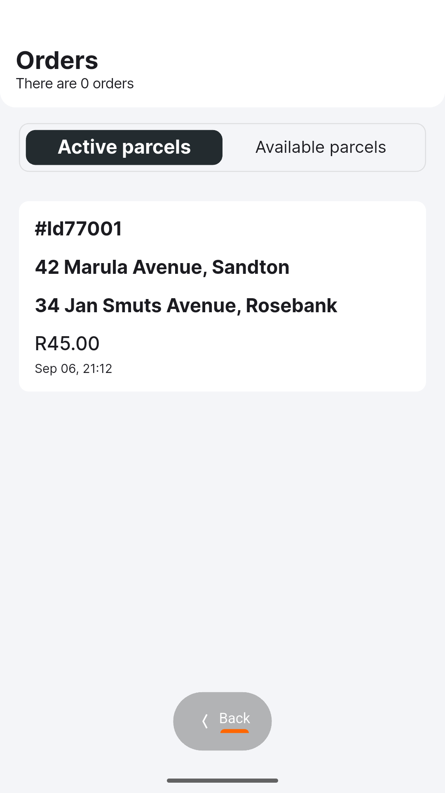

Documents and packages ride along - sender, receiver and fee on every parcel.

## 11. Pick up a parcel

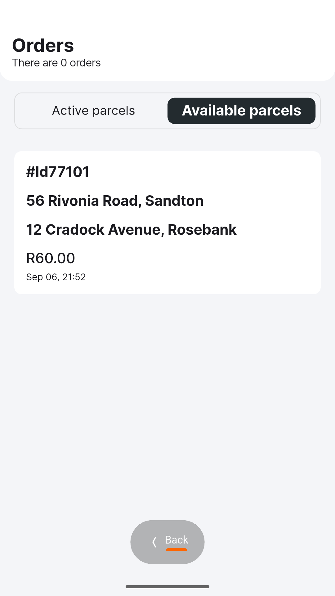

Parcels waiting nearby - add one to your run whenever it fits.

## 12. Parcel trail

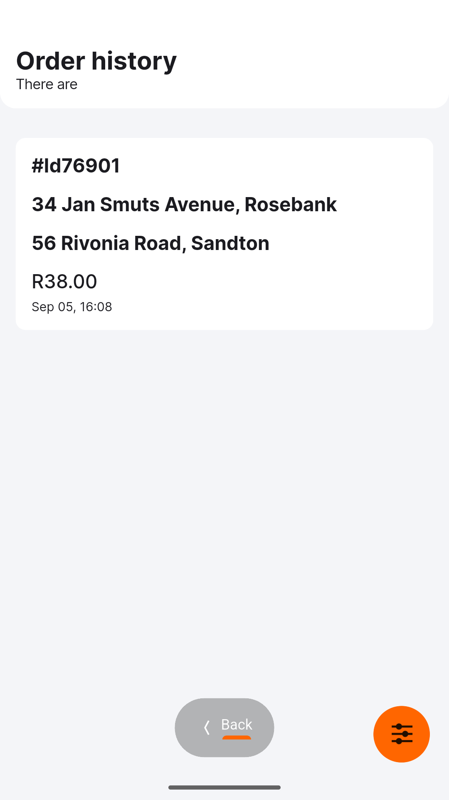

Delivered parcels keep their own history, ready whenever you need the paper
trail.

## 13. Draw where you deliver

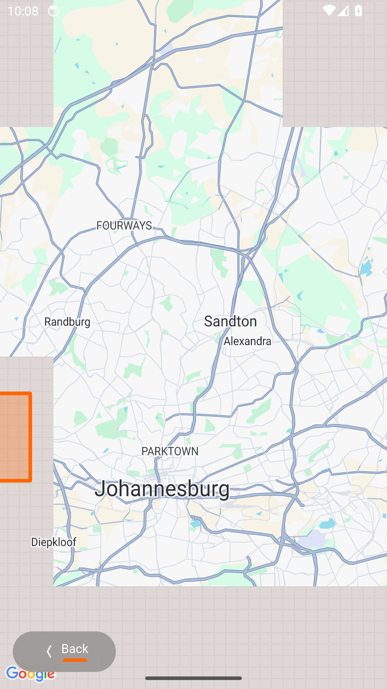

Your delivery zone on the map - redraw the outline whenever your patch changes,
and dispatch follows.

## 14. Money at a glance

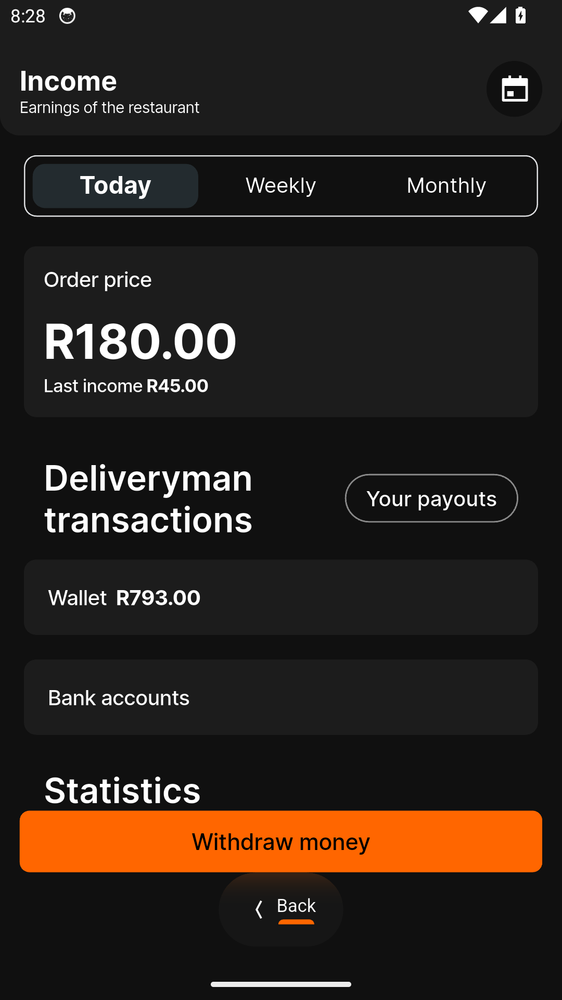

Today, this week or this month - every rand earned, charted day by day.

## 15. A calculator, right where you work

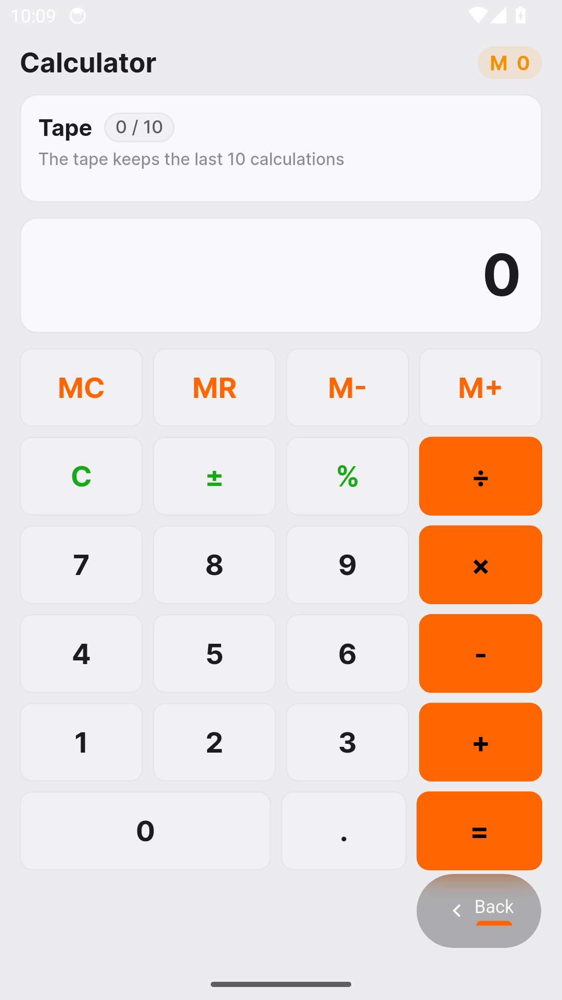

Quick sums without switching apps - a full calculator built in.

## 16. Your account at a glance

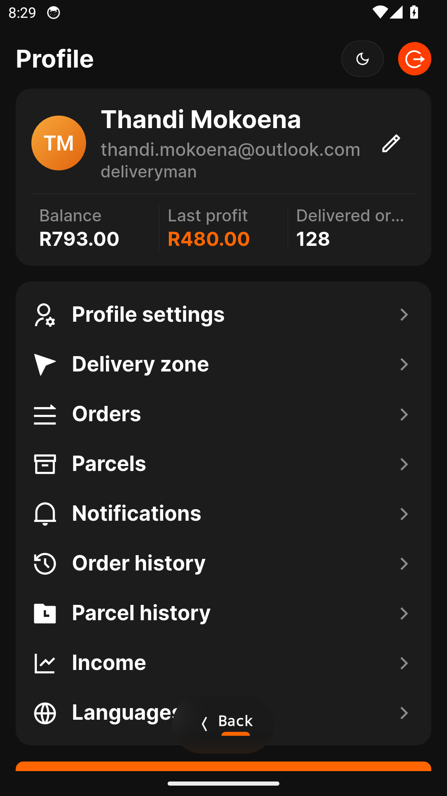

Your Driver account keeps your details in one place.

## 17. Keep your details fresh

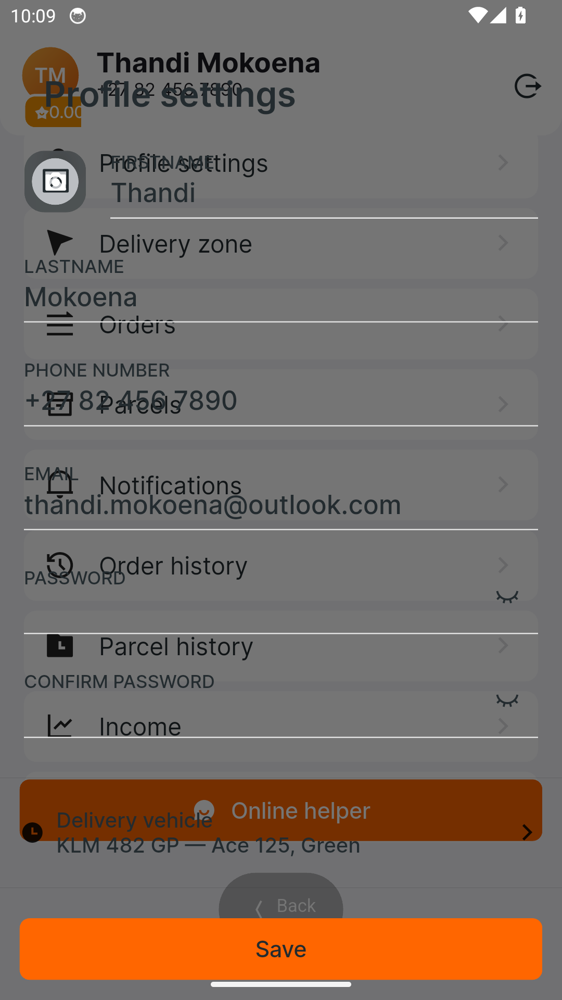

Update your name, phone and email any time they change.
