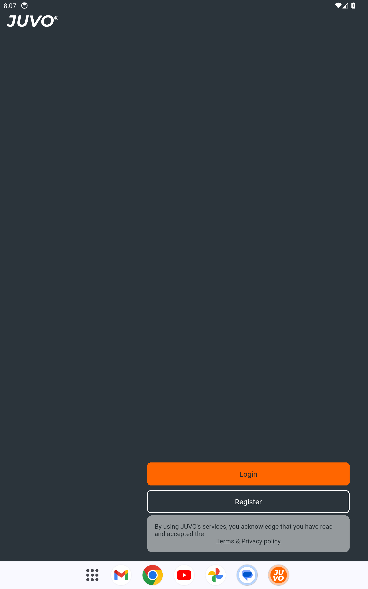
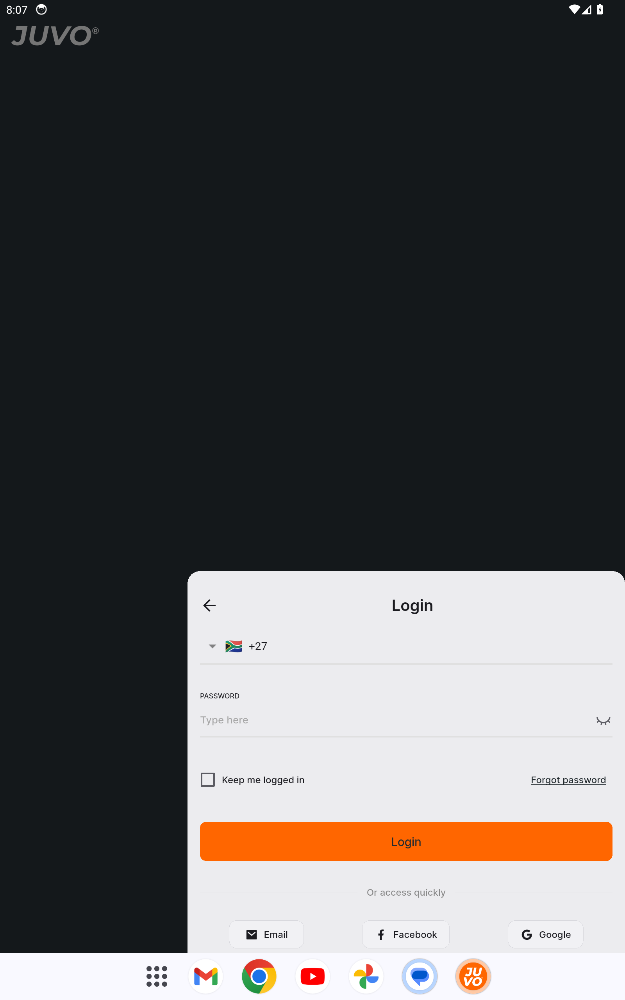
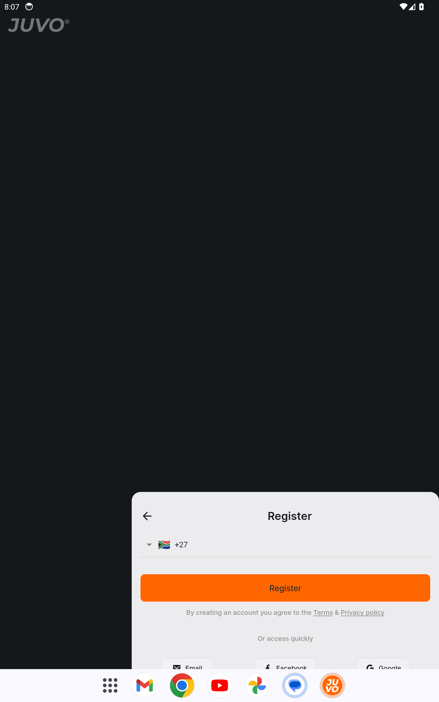
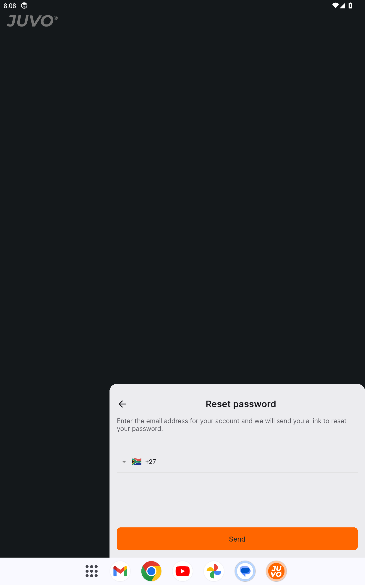
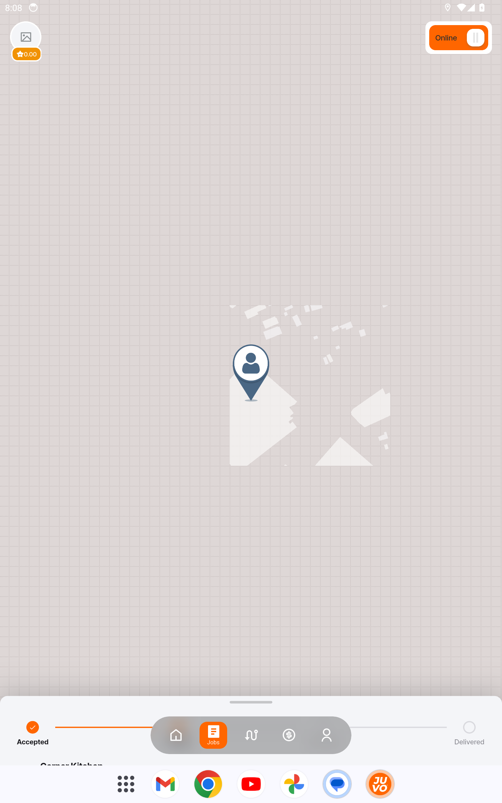
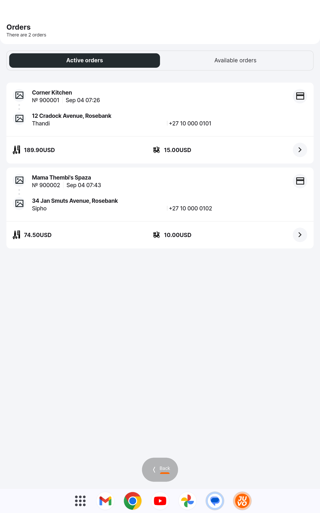

# Driver — Feature Guide

Deliveries, parcels and payouts in one app

> This guide is generated automatically on every merge: CI builds the
> app, walks the guided tour on an Android emulator, and captures
> each screen below.

## 1. Welcome to Driver

Driver puts your whole delivery day in one app - sign in to get started.

## 2. Sign in

Signing in to Driver is quick and simple.

## 3. Create an account

New to Driver? Create your account in a few easy steps.

## 4. Reset your password

Forgot your password? Driver gets you back in with a secure reset.

## 5. Your day on the map

Go online and drive - your zone, your current delivery and your next job all
live on one map.

## 6. Deliveries in hand

Every delivery you have accepted, with the customer, the total and the cash to
collect up front.
